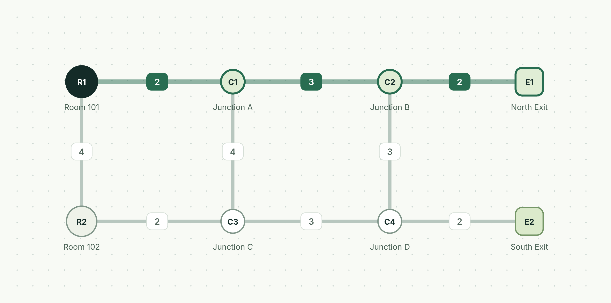
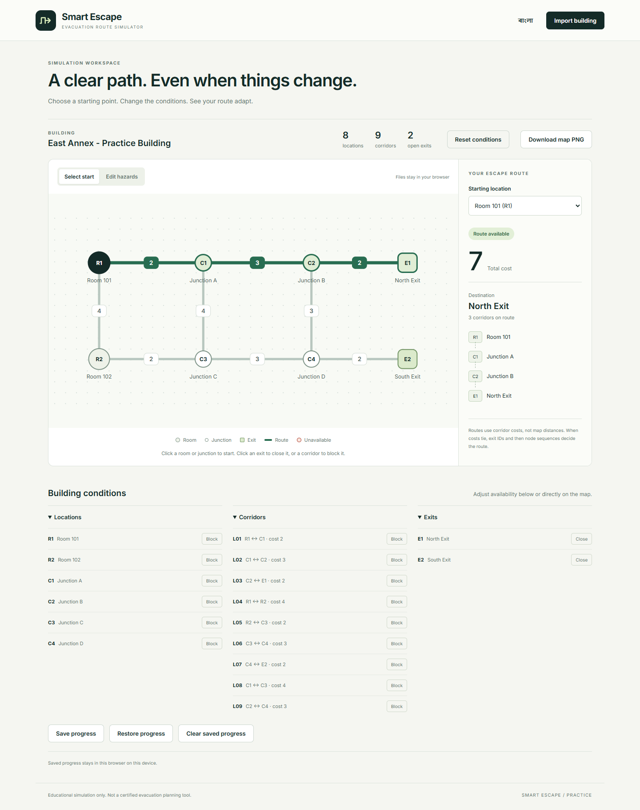
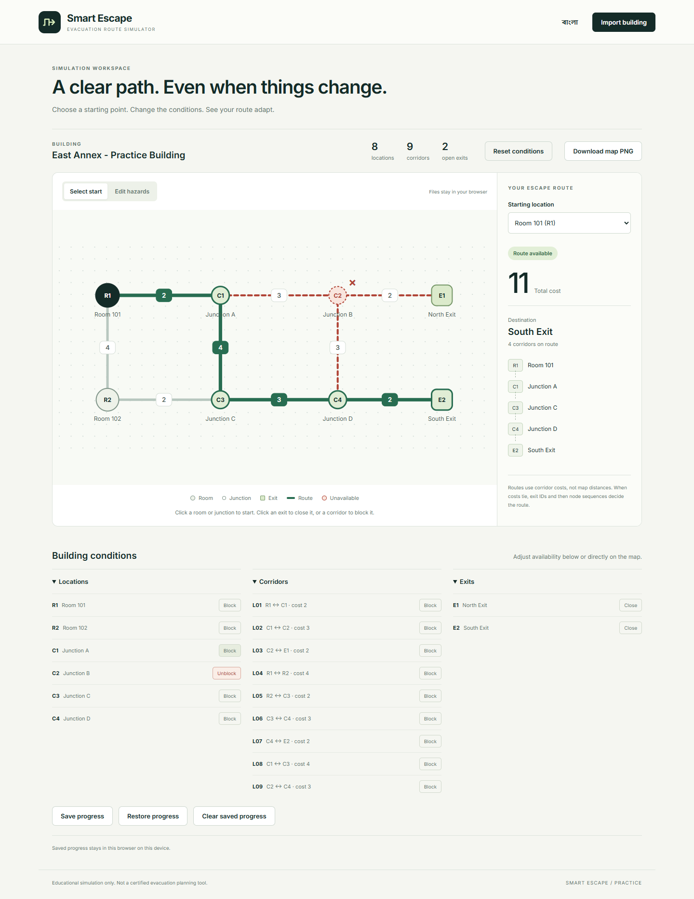
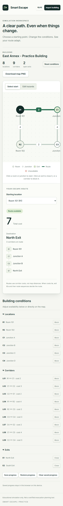
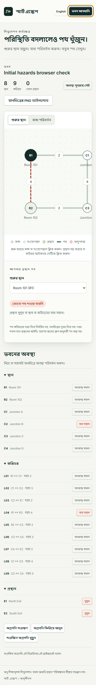
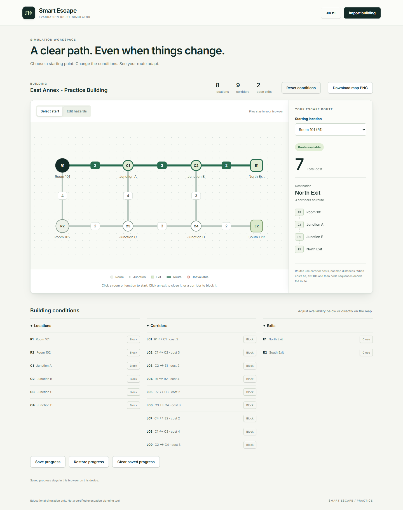

# Smart Escape

Browser-only evacuation route simulator for the **Smart Escape practice challenge**. This repository is practice, created before the official contest. Do not reuse its project code as a fresh contest submission.

**[Open live demo](https://smart-escape-practice-production.up.railway.app/)** · [Sample building JSON](data/building.json) · English / বাংলা

[](https://smart-escape-practice-production.up.railway.app/)

Built by **Abdullah Alif** · Student ID **252-15-834** · **252-15-834@diu.edu.bd**

## Run and verify

Requires Node.js 20 or later. No packages need installing.

```powershell
npm run dev
npm test
npm run build
```

Open http://127.0.0.1:5173. Choose **Load sample**, then select **R1**. To import another dataset, use **Import building**. Build output is in `dist/`; publish that folder to a static HTTPS host. The deployed app has no server, database, external runtime API, or credentials. All imported files stay in the browser.

## Features

- Validated local JSON import and supplied sample building.
- SVG map with supplied coordinates, distinct node types and corridor costs.
- Minimum-cost undirected routing, with exact exit and path tie-breaking.
- Block/unblock rooms, junctions and corridors; close/reopen exits.
- Immediate rerouting, blocked-start and no-route statuses, and reset to imported initial state.
- English/Bangla controls, errors, statuses and instructions.
- Keyboard controls, reduced-motion support, responsive layout, layered card depth, tactile hover states, and brief logo/route/panel animations.

Optional extensions implemented: keyboard access, reduced-motion support, PNG map export and browser-local saved progress. Use Save progress before leaving, then Restore progress after reopening this site in the same browser. Clear saved progress removes the stored snapshot without changing the current simulation. Alternative routes are not implemented.

## Demo gallery

Select **R1** for the baseline route, then block **C2** to see the route move to the South Exit. Both examples below keep the same starting location.

| Baseline · cost 7 | C2 blocked · cost 11 |
| --- | --- |
| [](screenshots/baseline.png) | [](screenshots/reroute-c2.png) |

<details>
<summary>Explore the Bangla mobile interface</summary>

<p></p>

<p></p>

</details>

<details>
<summary>View the full desktop interface</summary>



</details>

## Published sample checks

| Scenario | Expected |
| --- | --- |
| R1 baseline | R1 → C1 → C2 → E1, cost 7 |
| R1 with C2 blocked | R1 → C1 → C3 → C4 → E2, cost 11 |
| E1 and E2 closed | No route available |
| R2 baseline | R2 → C3 → C4 → E2, cost 7 |
| Selected R1 then blocked | Starting location blocked |

Screenshots: [baseline](screenshots/baseline.png), [C2 reroute](screenshots/reroute-c2.png), and [Bangla mobile view](screenshots/bangla-mobile.png). Tests also cover synthetic edge cases for routing and validation; no personal or private data is used.

An optional development-only browser acceptance script is available as `npm run check:browser`. It requires Playwright and installed Chrome; neither is shipped to the live app. Set `SMART_ESCAPE_PLAYWRIGHT` to an existing Playwright module path when using a bundled runtime. Set `SMART_ESCAPE_URL` to test a public deployment rather than the local development server. Actual results are saved in `screenshots/browser-results.json`.

For restricted environments where Node cannot launch test workers, Node 22+ can run `node --test --test-isolation=none`. This runs the same assertions in the current process; it does not bypass failing tests. The reviewed version passes 38 engine/storage tests. Additional Chrome checks are available through `check:map`, `check:export`, `check:session` and `check:mobile`; none ship to the deployed app.

## Deployment

Railway configuration is included for standard Caddy static-file hosting. Build tools run only in the image's build stage; the deployed image serves the runtime assets and does not run the development Node server. No database or volume is used. See `docs/DEPLOYMENT.md` for setup and verification.

## Submission information

- Name: Abdullah Alif.
- Student ID: 252-15-834.
- Email: 252-15-834@diu.edu.bd.
- Public HTTPS live link: https://smart-escape-practice-production.up.railway.app
- Known limitations: coincident coordinates and long map labels may overlap. Input files are limited to 2 MB and costs must remain within JavaScript's safe integer range. Railway availability depends on remaining trial credits.

Educational simulation only; not a certified real-world evacuation planning tool.

## License

MIT. Supplied sample data remains attributed to AI DevFest's Smart Escape practice materials.
